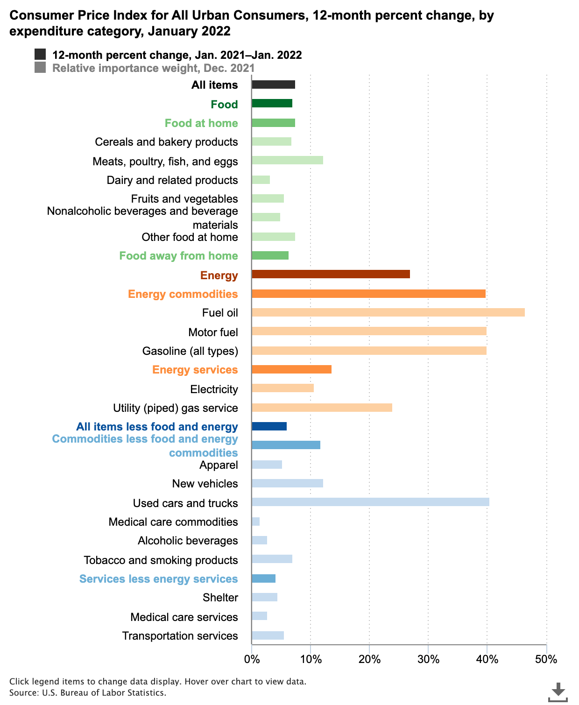
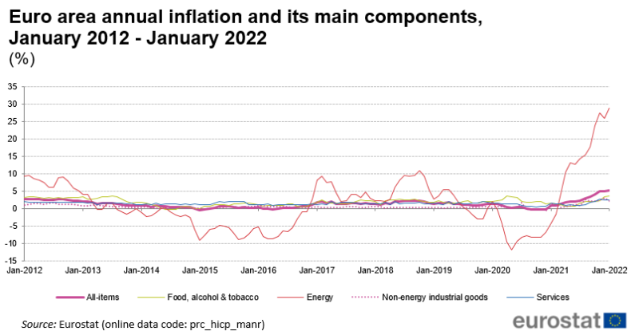

```{r setup, include=FALSE}
rm(list=ls());gc()
knitr::opts_chunk$set(echo = FALSE)
knitr::opts_chunk$set(fig.align = 'center')
```

```{r Packages, include=F}

library(tidyverse)
library(ranger)
library(zoo)
library(caret)
library(glmnet)
library(forecast)
library(sf)
library(rnaturalearth)
library(rnaturalearthdata)
library(viridis)
library(gridExtra)
library(ggthemes)
library(ggrepel)
library(countrycode)
library(RColorBrewer)
library(viridis)
library(shiny)
library(shinyWidgets)

```

# Introduction

The aim of this inquiry is to explore the application of machine learning techniques to the prediction of inflation rates for countries in the European Union. At the outset of this endeavor we had seen a rise in inflation as the economic consequences of the COVID-19 pandemic further set in. If the frequency of memes and mainstream media coverage about inflation may serve as an indicator of interest, prior to the completion of this paper, inflation had become a topic of considerable interest globally. With the consumer price index for Americans increasing by 6.8% in November 2021 compared to the previous year (now 7.5% higher for January compared to the previous year according to the U.S. Bureau of Labor Statistics), inflation has inserted itself into a greater number of daily conversations about things like gas prices, meat prices, electricity prices, etc.

```{r CPI, echo=F, fig.cap="Components of the Consumer Price Index"}



```

Centering our global perspective on Europe, in the years prior to the onset of the COVID-19, inflation in the European Union remained relatively low and stable until 2021, with Euro area annual inflation in January 2022 reaching 5.1% and energy prices doing their absolute worst to stay low. 

```{r Euro Inflation, echo=F, fig.cap="Euro area annual inflation and its main components"}



```

If we move beyond the typical "oh man that inflation is really kicking my ass at the pump" dialogue, we find that many contracts concerning employment, debt, sales, and tenancy are set in nominal terms. Therefore, accurate inflation forecasts are a valuable tool for the rational economic decision-making of businesses, policymakers, and households. With a greater degree of consequence, central banks rely on inflation forecasts to not only inform and shape monetary policy, but also to anchor inflation expectations and thus enhance policy efficacy. Many central banks release inflation forecasts on a regular basis in an effort to improve economic decision-making. What are the consequences of large forecast errors? A striking example comes from the European Central Bank (ECB), whose projections have been systematically and substantially above realized inflation (at least for the dates covered in our literature review which extends to 2019). Such systematic forecasting errors may undermine the European central banks' credibility and their ability to anchor inflation expectations, which can amount to potentially large welfare costs.

# Literature Review

There is a growing literature that applies machine learning to economics and in particular prediction problems. Kleinberg et al (2015) highlight how machine learning may help solve prediction issues better than conventional econometric techniques. Authors argue that traditional empirical approaches are not well suited to prediction challenges because they focus on unbiasedness, while machine learning methods are, as they are more focused on non-linear relations between phenomena. Prediction of inflation is one of the main areas of predicting macroeconomic variables for economic institutions and researchers and the advantages of machine learning in prediction pave the way for economists to use it as a new method in their prediction toolboxes. As our main purpose is predicting inflation, will review the related literature from different aspects including key drivers of inflation, the relative performance of machine learning methods, feature of machine learning characteristics, richness of available data, length of prediction, the importance of accurate prediction, and impact of data transformation.

Baybuza (2018), by using several basic machine learning methods: LASSO, Ridge, Elastic Net, Random Forest, and Boosting, confirms that the use of machine learning methods could improve inflation predicting accuracy in Russia. The first difference in the logarithms of price levels was taken to obtain the monthly inflation and inflation is predicted from 1 to 24 months ahead. The author argues that as many central banks practice inflation targeting to peruse price stability in their monetary framework, they have to publish inflation predictions and the accuracy of this prediction plays an important role in their credibility. Also, the paper elaborates more on the different time horizons in prediction. Inflation prediction in long-horizon could be less challenging as it is explainable by the neutrality of money. Conversely, in the short-run and due to lack of sufficient data, considering several covariates to explain inflation could lead to the curse of dimensionality. The main finding of this paper is compared to reference models (AR(1)) that only utilize inflation lags as predictors, machine learning approaches can enhance the quality of inflation predictions. Moreover, machine learning methods predict average Inflation better than the reference model from the second month onwards. Additionally, they find evidence on the role of data transformation in the outcomes, the Random Forrest and Boosting models perform better with untransformed rather than transformed data. Finally, the authors open the doors for using other nonlinear machine learning algorithms, e.g. neural networks, in predicting inflation in Russia for future studies.

Coulombe et al (2020), contribute to the literature by focusing on a very key question of "What are the key features of Machine Learning modeling that improve the macroeconomic prediction?". To examine the different features of machine learning methods, they observe the behavior of nonlinearities, regularization, cross-validation, and alternative loss functions in both rich and poor data contexts. In order to assess different Machine learning characteristics in the different data environments, they design an experiment and come up with four main findings: (1) For macroeconomic forecasting, nonlinearity is the key factor and by considering the more accurate result could be obtained, (2) when we work with big data, alternative regularization means of dimensionality reduction such as Lasso, Ridge, Elastic net do not improve on average over the standard factor model, (3) the hyperparameter selection by K-fold cross-validation and the standard BIC do better on average than any other criterion and is the best practice, (4) Replacing the standard in-sample quadratic loss function by e-insensitive loss function in Support Vector Regressions does not improve the result as it has a negative impact on both mean squared errors and absolute errors, and (5) using big data has a beneficial and significant marginal effect, that improves as the forecast horizon gets longer.

Kohlscheen (2021) shed some light on two major areas in inflation forecasting: main inflation causes and the effect of anticipation. The study employs advanced machine learning methods and forecasts inflation rates in 20 advanced countries between 2000 and 2021 based on six key macroeconomic indices by putting into consideration a non-parametric data-driven approach. The production gap, the cumulative percentage variation of the oil price (Brent) over a year, and the fluctuation of the BIS nominal effective exchange rate for each country, as well as the average PPI inflation measure in the three major economies, are among the explanatory factors. Due to the fact that machine learning methods take into account nonlinearities and sophisticated interactions between factors that occur in the real world, the author finds that the machine learning model outperforms traditional OLS results with the same set of explanatory variables which reveals the importance of this omitting relation in conventional econometric methods. Regarding the role of expectation, the author finds that while the expectation is the most important predictor of CPI inflation, its importance has decreased over the previous ten years. Additionally, Exchange rate fluctuations have been shown to have low forecasting power.

Finally the magnum opus of our literature review was found in Medeiros et al's 2019 paper "Forecasting Inflation in a Data-Rich Environment: The Benefits of Machine Learning Methods." In their paper they tackle the "why this approach?" question right at the outset by drawing attention to the recent "machine learning (ML) and "big data" boom in economic literature. They assert that these new methods are not just passing fads, but that they may indeed provide more accurate forecasts than the current standard, and note that there are few voices out there suggesting that ML techniques can deliver nontrivial gains over univariate benchmarks. This work of theirs seeks to remedy that.Their proof-of-concept is a study by Gu, Kelly, and Xiu (2018), which showed that ML methods coupled with hundreds of predictors were able to improve substantially out-of-sample stock return predictions, and mention that their own findings show gains of at least 30% in terms of mean-square errors. 

Their results showed that it is possible to consistently beat univariate benchmarks for inflation forecasting, namely, random walk (RW), autoregressive (AR), and unobserved components stochastic volatility (UCSV) models. Because rational economic decisions are made in real-time, they checked (and confirmed) the robustness of their results by considering a real-time experiment from 2001 to 2015.

To narrow the scope of our paper, we chose to focus on the the least absolute shrinkage and selection operator (LASSO) method, which Medeiros et al found to be second to the Random Forest method in terms of efficiency. We also followed their lead with respect to variable selection by utilizing the variables they found to be most significant among these classifications: output and income; labor market; housing; consumption, orders, and inventories; money and credit; interest and exchange rates; prices; stock market.   

# Methodology

As stated in the introduction, the aim of our project is to predict the inflation rates of the member countries of the Euro area until the first quarter of 2024. Our approach consists of four steps which are outlined in the graph below.

```{r Methodology, echo=F, fig.cap="Overview on our methodology to predict the inflation rates of the member countries of the Euro Area"}


```

Since we were not certain about the exact determinants of inflation or which variables we should include, we included a lot of features that could possibly affect inflation and applied the LASSO regression. The LASSO regression, which stands for Least Absolute Shrinkage and Selection Operator, is a shrinkage method that shrinks the coefficient of irrelevant variables to zero. In this way, we automated the variable selection.
The idea behind the LASSO regression is to add a shrinkage penalty to the OLS minimization problem utilizing a 1-norm of the coefficient vector. The coefficient estimates β_hat are values that minimize 

\begin{equation}
  RSS + \lambda \sum_{j+1}^{p}|\beta_{j}|
\end{equation}

The coefficients of variables with low predictive power shrink to zero, resulting in a simpler regression model that is easier to interpret.
Like the OLS, the LASSO estimate coefficients that fit the data well by minimizing the RSS. The tuning parameter λ controls the relative impact of these two terms on the regression coefficient estimates. For λ = 0, the LASSO estimates equal the OLS estimates since the penalty term then has no effect. On the other hand, as the tuning parameter λ approaches infinity, the impact of the shrinkage penalty becomes larger, and the LASSO regression coefficient estimates will approach zero.^[James, Witten, Hastie, Tibshirani (2014): An Introduction to Statistical Learning]

## Research, download, and prepare the data

As explained in the previous section, we have used two data sources for our project; data from EUROSTAT and data from the European Central Bank - Eurosystem. 

In order to access the EUROSTAT-dataset, we have used the eurostat-package provided by the European Union. For the data on M1-, M2-, and M3-indicators as well as the ECB deposit facility, ECB marginal lending facility, and ECB MRO - fixed rate tenders, we have manually downloaded the datasets from the European Central Bank - Eurosystem^[https://sdw.ecb.europa.eu].

As Data Wrangling- and Data Manipulation-Code is rather long, we have decided not to include the code itself into this document but only its final result. Should you be interested in the Data Wrangling-Code, you are welcome to look at it. The R-File is called `Data-Wrangling_lagged_Inflation.R`.

## Use Machine Learning to identify the most important variables that describe the inflation rates

After the Data Wrangling-Process, we have concluded that the best way to investigate our research question is to loop through each member country of the Euro Area, compute the individual numbers of interest, and finally, put them together in one file. We have considered it important that all of the observations as imputing a mean in this economic setting is prone to bias the results. Therefore, we have ignored all variables with uncomplete observations for each country.

As explained in the previous sections, we decided to use the Machine Learning-technique of LASSO Regression for our project. In order to do that we have first split the dataset into a training- and test-dataset with the ratio of 80% to 20%. Regarding the Cross Validation-computation, the ideal technique would be to use a time series cross-validation. However, as our background-paper used k-fold Cross Validation and the Root Mean Squared Errors using the time series cross-validation were consistently larger than in the k-fold cross validation-scenario, we concluded to use k-fold cross validation.

After applying the LASSO regression, we have extracted all of the variables that the model uses to make 'accurate' predictions. On the bottom of this section, you are able to see these variables for all the countries in the Euro Area.

## Prediction of the important variables into the future

After extracting the important variables, we have made predictions for these variables from Q1 2022 to Q1 2024 using the Holt-Winters-technique. Holt-Winters is one of the most popular forecasting techniques and takes three aspects into consideration when predicting time series; the average, the trend, and the slope of the time series^[For more information on the Holt-Winters-technique, please consult this website:https://orangematter.solarwinds.com/2019/12/15/holt-winters-forecasting-simplified/]. 

## Use LASSO regression to predict future inflation rates

In the final step, these predicted variables will be used to predict future inflation rates using the LASSO regression, we have applied in the first step. Equivalent to the second step of this Methodology-section, please select the country of your interest on the bottom of this section in order to see the predicted inflation rate of the respective country from Q1 2022 to Q1 2024.

<details>
<summary>Show/Hide Code</summary>
```{r data, echo=T, warning=F, message=F, fig.show='hide'}

load("Data_Wrangling_V1_lagged.rda")

total$geo <- countrycode(total$geo, "iso2c", "iso3c")

################
### Loop to calculate Inflation Rates
################

europe_map <- ne_countries(scale = "medium", type = "map_units", returnclass = "sf", continent = "Europe")
countries_plus <- ne_countries(scale = "medium", type = "map_units", returnclass = "sf")
countries_plus <- countries_plus %>% 
  filter(adm0_a3 %in% c("PRT", "CYP"), scalerank == 1)
europe_map <- rbind(europe_map, countries_plus)

country.list <- data.frame(matrix(nrow = 0, ncol = 3))
colnames(country.list) <- c("geo", "Change", "geometry")

pred_inflation <- list()
variable_importance <- list()
inflation_table <- list()

n = 1

for (country in unique(total$geo)){
  
  set.seed(99999)  
  
  #print(paste0(n, ": ", country))
  
  tmp.total <- total %>% 
    filter(geo == country) %>% 
    arrange(time)
  
  tmp.total_ <- tmp.total[, colSums(is.na(tmp.total)) != nrow(tmp.total)]
  
  tmp.total_ <- tmp.total_ %>% 
    mutate(`ECB_MRO_-_fixed_rate_tenders` = na.locf(`ECB_MRO_-_fixed_rate_tenders`)) %>% 
    mutate(ECB_deposit_facility = na.locf(ECB_deposit_facility)) %>% 
    mutate(ECB_marginal_lending_facility = na.locf(ECB_marginal_lending_facility))
  
  tmp.total_[nrow(tmp.total_), 23] <- 9.8
  tmp.total_[nrow(tmp.total_), 24] <- 6.9
  tmp.total_[nrow(tmp.total_), 25] <- 6.9
  
  tmp.total_[] <- lapply(tmp.total_, na.aggregate)
    
  
  ############
  ### split to training and test
  ############
  
  tmp.total_ <- tmp.total_ %>% 
    mutate(train_index = sample(c("train", "test"), nrow(tmp.total_), replace = TRUE, prob = c(0.8,0.2)))
  
  training_ <- tmp.total_ %>% 
    filter(train_index == "train") %>% 
    select(-train_index)
  
  test_ <- tmp.total_ %>% 
    filter(train_index == "test") %>% 
    select(-train_index)
  
  ####################
  ## Check performance
  #####################
  
  control <- trainControl(method = "repeatedcv", number = 10, repeats = 5, savePredictions = T)
  
  tuning_grid <- expand.grid(alpha = c(1), lambda = seq(0.05, 0.20, by = 0.05))
  
  lasso <- train(data = training_ %>% select(-geo, -time), Inflation ~ ., method = "glmnet",
                 trControl = control, tuneGrid = tuning_grid, 
                 importance = "impurity", metric = "RMSE", na.action = na.omit)
  
  training_$rf <- predict.train(lasso, newdata = training_)
  
  Metrics::rmse(actual = training_$Inflation,
                predicted = training_$rf)
  
  test_$rf <- predict.train(lasso, newdata = test_)
  
  Metrics::rmse(actual = test_$Inflation,
                predicted = test_$rf)
  
  ###################################
  # Plot variable importance
  ###################################
  
  varimp <- varImp(lasso)
  varimp <- varimp$importance
  varimp$variable <- rownames(varimp)
  varimp <- varimp[order(-varimp$Overall),]
  varimp <- head(varimp, 10)
  varimp$variable <- gsub("`", "", varimp$variable)
  
  s <- ggplot(varimp, aes(x = reorder(variable, Overall, FUN = max), Overall)) +
    geom_bar(stat = "identity", fill = "darkgreen") +
    coord_flip() +
    labs(x = "", y = "", title = "Variable Importance Plot", subtitle = "Top 10 Variables") +
    scale_y_continuous(breaks = seq(25, 100, by = 25), labels = scales::percent_format(scale = 1)) +
    theme_economist()+
    theme(panel.grid.minor = element_blank(),
          panel.grid.major.x = element_line(colour = "gray50", size = 0.5),
          panel.grid.major.y = element_blank(),
          line = element_blank()) +
    theme(plot.title = element_text(face = "bold", size = 13),
          plot.subtitle = element_text(face = "italic", size = 9),
          plot.background = element_rect(fill = "beige"))
  
  variable_importance[[country]] <- s
  
  ##############################################################
  ### Predictions into the future - Inflation with Holt Winters
  ##############################################################
  
  impvars <- varimp %>% 
    filter(Overall > 0)
  impvars <- impvars$variable
  
  tmp.total_pred <- tmp.total_ %>% 
    arrange(time) %>% 
    unique() 
  
  tmp.total_pred <- tmp.total_pred[,colnames(tmp.total_pred) %in% c("time", "geo", impvars, "Inflation")]
  
  tmp.total_pred$time <- as.Date(tmp.total_pred$time, "%Y-%m-%d")
  
  
  params <- names(tmp.total_pred)[3:(ncol(tmp.total_pred)-1)]
  
  tmp.total_variables <- list()
  
  {
  
  tmp.total.tmp <- data.frame(time = as.Date(c("2022-03-01", "2022-06-01", "2022-09-01", "2022-12-01","2023-03-01", "2023-06-01", "2023-09-01", "2023-12-01", "2024-03-01")),
                            geo = country)
  
  for (parameter in params) {
    
    ts <- ts(tmp.total_pred[parameter], start = c(2010,1), frequency = 4)
    hw <- HoltWinters(ts)
    hw_pred <- predict(hw, 9, prediction.interval = T, level = 0.95)
    
    pred <- data.frame(hw_pred[,1])
    names(pred) <- parameter
    pred$time <- as.Date(c("2022-03-01", "2022-06-01", "2022-09-01", "2022-12-01","2023-03-01", "2023-06-01", "2023-09-01", "2023-12-01", "2024-03-01"))
    
    tmp.total.tmp <- left_join(tmp.total.tmp, pred)
    
    pred[,1] <- as.numeric(pred[,1])
    pred$up <- hw_pred[,2]
    pred$low <- hw_pred[,3]
    pred$up <- as.numeric(pred$up)
    pred$low <- as.numeric(pred$low)
    pred <- pred %>% 
      select(time, "predictions" = parameter, up, low)
    
    variable <- tmp.total_pred %>% 
      select(time, parameter)
    
    variable$up <- NA; variable$low <- NA
    
    names(variable) <- c("time", "predictions", "up", "low")
    
    variable$time <- as.Date(variable$time, "%Y-%m-%d")
    
    variable <- rbind(variable, pred)
    
    p <- ggplot() +
      geom_line(data = variable %>% filter(time <= "2021-12-01"), aes(x = time, y = predictions), color = "black") +
      geom_line(data = variable %>% filter(time > "2021-12-01"), aes(x = time, y = predictions), color = "blue", linetype = "dashed") +
      geom_line(data = variable %>% filter(time > "2021-12-01"), aes(x = time, y = up), color = "red", linetype = "dashed") +
      geom_line(data = variable %>% filter(time > "2021-12-01"), aes(x = time, y = low), color = "red", linetype = "dashed") +
      labs(title = parameter, x ="", y = "Value") +
      theme_economist()+
      theme(plot.title = element_text(face = "bold", size = 9),
            plot.background = element_rect(fill = "beige"))
    
    tmp.total_variables[[parameter]] <- p
    
  }
  
}
 
    {
    
    tmp.total.up <- data.frame(time = as.Date(c("2022-03-01", "2022-06-01", "2022-09-01", "2022-12-01","2023-03-01", "2023-06-01", "2023-09-01", "2023-12-01", "2024-03-01")),
                               geo = country)
    
    for (parameter in params) {
      
      ts <- ts(tmp.total_pred[parameter], start = c(2010,1), frequency = 4)
      hw <- HoltWinters(ts)
      hw_pred <- predict(hw, 9, prediction.interval = T, level = 0.95)
      
      up <- data.frame(hw_pred[,2])
      names(up) <- parameter
      up$time <- as.Date(c("2022-03-01", "2022-06-01", "2022-09-01", "2022-12-01","2023-03-01", "2023-06-01", "2023-09-01", "2023-12-01", "2024-03-01"))
      
      tmp.total.up <- left_join(tmp.total.up, up)
      
    }
    
    lasso_tmp.total <- train(data = training_ %>% 
                               select(impvars, Inflation), Inflation ~ ., method = "glmnet",
                             trControl = control, tuneGrid = tuning_grid, importance = "impurity", metric = "RMSE")
    
    training_$rf <- predict.train(lasso_tmp.total, newdata = training_)
    
    Metrics::rmse(actual = training_$Inflation,
                  predicted = training_$rf) 
    
    test_$rf <- predict.train(lasso_tmp.total, newdata = test_)
    
    Metrics::rmse(actual = test_$Inflation,
                  predicted = test_$rf)
    
    tmp.total.up$Inflation <- predict.train(lasso_tmp.total, newdata = tmp.total.up)
    
    tmp.total_final_up <- rbind(tmp.total_pred, tmp.total.up)
    
    }
  
  {
    
    tmp.total.low <- data.frame(time = as.Date(c("2022-03-01", "2022-06-01", "2022-09-01", "2022-12-01","2023-03-01", "2023-06-01", "2023-09-01", "2023-12-01", "2024-03-01")),
                               geo = country)
    
    for (parameter in params) {
      
      ts <- ts(tmp.total_pred[parameter], start = c(2010,1), frequency = 4)
      hw <- HoltWinters(ts)
      hw_pred <- predict(hw, 9, prediction.interval = T, level = 0.95)
      
      low <- data.frame(hw_pred[,3])
      names(low) <- parameter
      low$time <- as.Date(c("2022-03-01", "2022-06-01", "2022-09-01", "2022-12-01","2023-03-01", "2023-06-01", "2023-09-01", "2023-12-01", "2024-03-01"))
      
      tmp.total.low <- left_join(tmp.total.low, low)
      
    }
    
    lasso_tmp.total <- train(data = training_ %>% 
                               select(impvars, Inflation), Inflation ~ ., method = "glmnet",
                             trControl = control, tuneGrid = tuning_grid, importance = "impurity", metric = "RMSE")
    
    training_$rf <- predict.train(lasso_tmp.total, newdata = training_)
    
    Metrics::rmse(actual = training_$Inflation,
                  predicted = training_$rf)
    
    test_$rf <- predict.train(lasso_tmp.total, newdata = test_)
    
    Metrics::rmse(actual = test_$Inflation,
                  predicted = test_$rf)
    
    tmp.total.low$Inflation <- predict.train(lasso_tmp.total, newdata = tmp.total.low)
    
    tmp.total_final_low <- rbind(tmp.total_pred, tmp.total.low)
    
  }
  
  do.call("grid.arrange", tmp.total_variables)
  
  lasso_tmp.total <- train(data = training_ %>% 
                             select(impvars, Inflation), Inflation ~ ., method = "glmnet",
                           trControl = control, tuneGrid = tuning_grid, importance = "impurity", metric = "RMSE")
  
  training_$rf <- predict.train(lasso_tmp.total, newdata = training_)
  
  Metrics::rmse(actual = training_$Inflation,
                predicted = training_$rf)
  
  test_$rf <- predict.train(lasso_tmp.total, newdata = test_)
  
  Metrics::rmse(actual = test_$Inflation,
                predicted = test_$rf)
  
  tmp.total.tmp$Inflation <- predict.train(lasso_tmp.total, newdata = tmp.total.tmp)
  
  tmp.total_final <- rbind(tmp.total_pred, tmp.total.tmp)
  
  inflation_table[[country]] <- tmp.total_final %>% 
    select(time, geo, Inflation) %>% 
    mutate(Inflation = round(Inflation, digits = 4))
  
  i <- ggplot() +
    geom_line(data = tmp.total_final %>% filter(time <= "2021-12-01"), aes(x = time, y = Inflation), color = "black") +
    geom_line(data = tmp.total_final %>% filter(time > "2021-12-01"), aes(x = time, y = Inflation), color = "blue", linetype = "dashed") +
    geom_line(data = tmp.total_final_up %>% filter(time > "2021-12-01"), aes(x = time, y = Inflation), color = "red", linetype = "dashed") +
    geom_line(data = tmp.total_final_low %>% filter(time > "2021-12-01"), aes(x = time, y = Inflation), color = "red", linetype = "dashed") +
    geom_text_repel(data = tmp.total_final_up %>% filter(time == "2021-12-01"), aes(x = time, y = Inflation), label = "Last Observation (Q4 2021)",
                    nudge_y = 1, fontface = "italic", size = 6,
                    segment.linetype = 3,
                    segment.color = "red") +
    labs(title = paste0("Change of Inflation Rate in ", country), y = "Inflation Rate (in %)", x = "") +
    scale_y_continuous(labels = scales::percent_format(scale = 1)) +
    theme_economist()+
    theme(plot.title = element_text(face = "bold", size = 15),
          plot.background = element_rect(fill = "beige"))
  
  pred_inflation[[country]] <- i
  
  tmp.total_map <- tmp.total_final %>% 
    filter(time >= "2022-03-01") %>% 
    select(geo, Inflation)
  
  tmp.total_map$Change <- tmp.total_map[nrow(tmp.total_map), ncol(tmp.total_map)] - tmp.total_map[1, ncol(tmp.total_map)]
  tmp.total_map <- tmp.total_map[1,]
  
  aut <- left_join(tmp.total_map, europe_map, by = c("geo" = "adm0_a3"))
  aut <- aut %>% 
    select(geo, Change, geometry)
  
  country.list <- rbind(country.list, aut)

  n = n + 1
  
}
```
</details>

## Visualization of the Variable Importance Plots and Predicted Inflation Rates per country

In this last part of the Methodology-section, you can see the most important variables that describe the inflation rates and the predictions of these inflation rates from Q1 2022 to Q4 2024 for each country. Please select the country according to its iso3-code and the according plots will appear automatically.

```{r input_selection, echo=TRUE}

selectInput("countries", label = "Select a country:",
            choices = unique(total$geo))

renderPlot(variable_importance[[input$countries]])

renderPlot(pred_inflation[[input$countries]])

DT::renderDataTable({
  DT::datatable(
    inflation_table[[input$countries]],
    rownames = F,
    class = list(stripe = F),
    options = list(dom = "tp")
  )
})

```

# Results

We have predicted the future inflation rates for all the member countries of the Euro Area using a Loop. Ultimately, we have calculate the difference in percentage-points between the last observation of the inflation rate (Q4 2021) and the end-point of our prediction (Q1 2024) to see how much the inflation rate is predicted to change.

```{r Predictions}

load("predictions.RData")

DT::datatable(
  predictions,
  class = list(stripe = F),
  options = list(dom = "tp")
  )

```

The main results of this paper is presented in the above table. The table shows the predictions of inflation rates for the 19 members of the Euro area from Q1 2022 to Q1 2024.
According to our predicted results, the upward trend of inflation rates in the Euro area lasts throughout the periods of interest. Given these results, we conclude that the ECB can no longer justify its low nominal interest rates.

We have visualized the results using a geographical map. According to the colors, our computations lead to diverging results in terms of geography between the Baltic countries and the other countries of the Euro Area. While in the Baltic countries, the change of the predicted inflation rate ranges from 16% in Latvia to more than 30% in Estonia, it does not look as grave in the other countries.

```{r Geographical Plot, echo=T, fig.cap="Changes of inflation rates in the member countries of the Euro Area between Q4 2021 and Q1 2024; no data available for Greece."}
ggplot()+
  geom_sf(data = europe_map, fill = "white", lwd = 0) +
  geom_sf(data = country.list, mapping = aes(geometry = geometry, fill = Change), lwd = 0) +
  scale_fill_viridis(option = "turbo") +
  coord_sf(
    xlim = c(-22, 50),
    ylim = c(34, 71),
    datum = NA
  ) +
  labs(title = "Change of Inflation Rates", subtitle = "Percentage-Change between Q4 2021 & Q1 2024") +
  theme_classic() +
  theme(legend.title = element_blank()) +
  theme(panel.background = element_rect("lightblue")) +
  theme(plot.title = element_text(face = "bold"), plot.subtitle = element_text(face = "italic", size = 9, hjust = 0))

```

It is difficult to assess how realistic these results are, especially in the Baltic countries. However, looking at the trajectory of the historic inflation rates of the Baltics, it is at least not surprising why our model shows these results.

```{r Baltics, echo=F, fig.cap="The inflation rate of the Baltic Countries from February 2021 to January 2022 (left: Lithuania, center: Latvia, right: Estonia), source: Trading Economics"}

baltics <- read_table2("Baltics_Inflation_Rates.csv")

baltics$Lithuania <- gsub(",", ".", baltics$Lithuania);baltics$Lithuania <- as.numeric(baltics$Lithuania)

baltics$Latvia <- gsub(",", ".", baltics$Latvia);baltics$Latvia <- as.numeric(baltics$Latvia)

baltics$Estonia <- gsub(",", ".", baltics$Estonia);baltics$Estonia <- as.numeric(baltics$Estonia)

colors <- c("Lithuania" = "blue", "Latvia" = "red", "Estonia" = "darkgreen")

ggplot(data = baltics) +
  geom_line(aes(x = Time, y = Lithuania, color = "Lithuania")) +
  geom_line(aes(x = Time, y = Latvia, color = "Latvia")) +
  geom_line(aes(x = Time, y = Estonia, color = "Estonia")) +
  scale_x_date(date_labels = "%m %Y") +
  labs(title = "Inflation Rates in the Baltics", subtitle = "Observations from February 2021 to January 2022", caption = "Source: Trading Economics", x = "", y = "", color = "") +
  theme_economist() +
  theme(plot.title = element_text(face = "bold", size = 15),
        plot.subtitle = element_text(face = "italic", size = 9, hjust = 0),
        plot.background = element_rect(fill = "beige"),
        plot.caption = element_text(face = "italic", hjust = 0, size = 8)) +
  theme(legend.position = "bottom", legend.text = element_text(size = 8)) +
  scale_y_continuous(labels = scales::percent_format(scale = 1))

```

# Conclusion

The COVID-19-pandemic not only shook the world in terms of public health, but also economically. Especially the inflation rates surged in the course of the pandemic globally. While the FED is planning to increase the interesting rate by mid-March^[see https://www.bloomberg.com/news/articles/2022-02-24/fed-officials-signal-march-rate-hike-is-on-track-despite-ukraine], the ECB is more silent towards the increase of the interest rate, even though the inflation rates of the European countries are increasing as well.

The goal of our project is to predict the inflation rates of the member countries of the Euro Area until Q1 2024. We have used the paper ... as the baseline for our project and used their recommended approach to explain the inflation rate in USA to explain and predict the inflation rates of the member countries of the Euro Area. In terms of data, we have generally used the EUROSTAT- and the European Central Bank-Eurosystem-dataset.

For each country, we have applied a LASSO regression with k-means Cross Validation. We have identified those variables that are contributing to the explanation of the inflation rate and predicted those variables into the future using the Holt Winters-method. Ultimately, we have used the LASSO regression to calculate the future inflation rates of the member countries of the Euro Area based on the predicted variables.

Ultimately, the user can look on the significant variables and the predicted inflation rates in graphical and tabular form. Also, we have visualized the change of inflation rates between Q1 2024 and Q1 2022 on a world map.

Overall, we observe that the inflation rates will go up in all of the countries. In most of the countries, this change will be around 10 percentage-points but in the Baltics, the change of inflation rates seems to be much higher. This makes us conclude that the ECB actually can no longer justify to keep the nominal interest rate at zero and rather follow the policy of the Federal Reserve.

We are aware that due to time constraints, these results should be handled with caution. This is mainly because the data selection-process was quite difficult due to different types of data between the FRED-database and the EUROSTAT-dataset. Furthermore, the EUROSTAT-dataset has some gaps when it comes to south- and east European countries. Current events, especially the ongoing conflicts between the Russian Federation and Ukraine and the European Union, however, will probably shift the priorities of the ECB significantly.

# Bibliography

---
nocite: '@*'
...
